<a name="row 1-6"/>

Row 1 - 6
---------

[c]: /GroundForge/sheet?patch=88%0A11;bricks&patch=66%0A22;bricks&patch=88%0A99%0A11%0A00;bricks&patch=66%0A11%0A88%0A22;bricks&patch=66%0A99%0A22%0A00;bricks
[t]: /GroundForge/sheet?patch=53%0A53%0A53%0A5-;bricks&patch=5663%0A5663;checker&patch=53%0A5-;bricks&patch=563%0A563%0A563;checker&patch=53%0A53;checker&patch=5632%0A5632;checker&patch5353%0A5353;bricks&patch=5-%0A-5;checker&patch=5353%0A5353%0A5-5-%0A-5-5;checker&patch=5632%0A56-2%0A5-5-%0A-535;checker&patch=53%0A5-%0A-5%0A5-;bricks&patch=44%0A77%0A44%0A77;bricks&patch=44%0A44%0A77%0A77;bricks&patch=66%0A88%0A66%0A11;bricks&patch=66%0A66%0A88%0A11;checker&patch=66%0A66%0A99%0A00;checker&patch=6;checker&patch=566-%0A66-5%0A6-56%0A-566;checker
[v]: /GroundForge/sheet?patch=5831%0A-4-7;bricks&patch=-437%0A34-7;bricks&patch=4830%0A--77;bricks
[k]: /GroundForge/sheet?patch=B-C-%0A---5%0AC-B-%0A-5--;checker&patch=5831%0A-4-7;checker&patch=68%0A-4;checker&patch=-4-7%0A5---%0A-C-B%0A3158;bricks&patch=5-O-E-%0A-E-5-O%0A5-O-E-;bricks
[wk]: /GroundForge/sheet?patch=6868%0A-4-4%0A2121%0A-7-7;checker&patch=L-O-L-O-%0A---5---5%0AH-E-H-E-%0A-5---5--;bricks
[ts]: /GroundForge/sheet?patch=5-5-%0A-5--%0AB-C-%0A-5-5;bricks&patch=5632%0A34-7;bricks&patch=256-%0A---5%0AC3B-;bricks&patch=4373%0A5-53;bricks
[z]: /GroundForge/sheet?patch=1483%0A8-48;bricks&patch=C-B-%0A-5--%0AB8D-%0A-4--;bricks&patch=-48-%0AB--2%0A8-B8;bricks&patch=-4--%0AB-C3%0A8-48;bricks

[A1]: /GroundForge/tiles?whiting=A1_P70&tile=88,11&patchWidth=5&patchHeight=5&a1=ct&b1=ct&a2=ct&b2=ct&shiftColsSE=2&shiftRowsSE=2&shiftColsSW=0&shiftRowsSW=2
[B1]: /GroundForge/tiles?whiting=B1_P94&tile=5-&a1=ctctpctct&patchWidth=5&patchHeight=5&shiftColsSE=1&shiftRowsSE=1&shiftColsSW=-1&shiftRowsSW=1
[C1]: /GroundForge/tiles?whiting=C1_P114&tile=5-&a1=ctpct&patchWidth=6&patchHeight=6&shiftColsSE=1&shiftRowsSE=1&shiftColsSW=-1&shiftRowsSW=1&footside=
[D1]: /GroundForge/tiles?whiting=D1_P134&tile=5-&a1=cttpctt&patchWidth=5&patchHeight=5&shiftColsSE=1&shiftRowsSE=1&shiftColsSW=-1&shiftRowsSW=1
[E1]: /GroundForge/tiles?whiting=E1_P155&tile=5-&a1=ctpcttt&patchWidth=5&patchHeight=5&shiftColsSE=1&shiftRowsSE=1&shiftColsSW=-1&shiftRowsSW=1
[F1]: /GroundForge/tiles?whiting=F1_P177&tile=5-&a1=cttpcttt&patchWidth=5&patchHeight=5&shiftColsSE=1&shiftRowsSE=1&shiftColsSW=-1&shiftRowsSW=1
[G1]: /GroundForge/tiles?whiting=G1_P198&patchWidth=5&patchHeight=5&a1=ctctptt&tile=5-&tileStitch=ctctptt&shiftColsSW=-1&shiftRowsSW=1&shiftColsSE=1&shiftRowsSE=1

[A2]: /GroundForge/tiles?whiting=A2_P71&tile=831,4-7,-5-&headside=d,-,c,-&footside=b,-,a,-&footsideStitch=ctctt&patchWidth=9&patchHeight=10&k1=lctctt&d1=ct&c1=ctct&b1=ct&a1=rctctt&d2=ctct&b2=ctct&k3=lctctt&c3=ctct&a3=rctctt&tileStitch=ctct&headsideStitch=ctctt&shiftColsSW=-2&shiftRowsSW=2&shiftColsSE=2&shiftRowsSE=2
[B2]: /GroundForge/tiles?whiting=B2_P95&patchWidth=9&patchHeight=10&k1=lctctt&d1=ctct&c1=ctct&b1=ctct&a1=rctctt&d2=ctct&b2=ctct&k3=lctctt&c3=ctct&a3=rctctt&footside=b,-,a,-&tile=831,4-7,-5-&headside=d,-,c,-&footsideStitch=ctctt&tileStitch=ctct&headsideStitch=ctctt&shiftColsSW=-2&shiftRowsSW=2&shiftColsSE=2&shiftRowsSE=2
[D2]: /GroundForge/tiles?whiting=D2_P135&patchWidth=16&patchHeight=15&c1=ctct&tile=--5--,-L-H-,L-5-H,-5-5-,b-5-c,-5-5-,,,&tileStitch=ct&shiftColsSW=0&shiftRowsSW=6&shiftColsSE=5&shiftRowsSE=3
[E2]: /GroundForge/tiles?whiting=E2_P156&patchWidth=13&patchHeight=12&e1=ctctttctc&a1=ctcctc&h2=ctc&g2=ctclll&f2=ctc&e2=ctc&d2=ctc&c2=ctcrrr&b2=ctc&h3=ctclll&g3=ctc&f3=ctc&d3=ctc&c3=ctc&b3=ctcrrr&a3=ctc&tile=5---5---,-CD632AB,5666-222&tileStitch=ctc&shiftColsSW=-4&shiftRowsSW=3&shiftColsSE=4&shiftRowsSE=3
[F2]: /GroundForge/tiles?whiting=F2_P178&patchWidth=11&patchHeight=13&b1=ctcctc&c2=ctcrrr&a2=ctclll&d3=ctc&b3=ctcttt&c4=ctc&a4=ctc&tile=-5--,B-C-,-5-5,5-5-&tileStitch=ctc&shiftColsSW=-2&shiftRowsSW=4&shiftColsSE=2&shiftRowsSE=4
[G2]: /GroundForge/tiles?whiting=G2_P199&patchWidth=14&patchHeight=13&f1=ctctt&a1=ctcctc&j2=ctc&i2=ctcll&h2=ctctt&g2=ctctt&f2=ctctt&e2=ctctt&d2=ctctt&c2=ctcrrr&b2=ctc&j3=ctcll&i3=ctctt&h3=ctctt&g3=ctcttl&f3=ctc&e3=ctcttr&d3=ctctt&c3=ctctt&b3=ctcrrr&a3=ctc&j4=ctctt&i4=ctctt&h4=ctcttl&g4=ctc&f4=ctc&e4=ctc&d4=ctcttr&c4=ctctt&b4=ctctt&a4=ctcttt&j5=ctctt&i5=ctcttl&h5=ctc&g5=ctc&e5=ctc&d5=ctc&c5=ctcttr&b5=ctctt&a5=ctctt&tile=5----5----,-CDD632AAB,5666632222,5666632222,56666-2222&tileStitch=ctct&shiftColsSW=-5&shiftRowsSW=5&shiftColsSE=5&shiftRowsSE=5
[H2]: /GroundForge/tiles?whiting=H2_P220&patchWidth=15&patchHeight=15&e1=cttctt&a1=ctcctc&h2=ctc&g2=ctc&f2=rrrcttcttl&e2=ctc&d2=lllcttcttr&c2=ctc&b2=ctc&h3=ctc&g3=rrrcttcttl&f3=ctc&e3=ctc&d3=ctc&c3=lllcttcttr&b3=ctc&a3=ctc&h4=rrrcttcttl&g4=ctc&f4=ctc&d4=ctc&c4=ctc&b4=lllcttcttr&a4=ctc&tile=5---5---,-CD632AB,56663222,5666-222&tileStitch=ctc&shiftColsSW=-4&shiftRowsSW=4&shiftColsSE=4&shiftRowsSE=4

[A3]: /GroundForge/tiles?whiting=A3_P73&patchWidth=7&patchHeight=6&a1=ctctctt&tile=5-&footsideStitch=ctctt&tileStitch=ctctpctctt&headsideStitch=ctctt&shiftColsSW=-1&shiftRowsSW=1&shiftColsSE=1&shiftRowsSE=1
[B3]: /GroundForge/tiles?whiting=B3_P96&patchWidth=6&patchHeight=6&a1=ctctctctt&tile=5-&footsideStitch=ctctt&tileStitch=ctctctctt&headsideStitch=ctctt&shiftColsSW=-1&shiftRowsSW=1&shiftColsSE=1&shiftRowsSE=1
[C3]: /GroundForge/tiles?whiting=C3_P117&patchWidth=7&patchHeight=6&a1=ctctpctctt&tile=5-&tileStitch=ctctpctctt&shiftColsSW=-1&shiftRowsSW=1&shiftColsSE=1&shiftRowsSE=1
[D3]: /GroundForge/tiles?whiting=D3_P136&patchWidth=7&patchHeight=6&a1=ctctctctctct&tile=5-&footsideStitch=ctctt&tileStitch=ctctpctctt&headsideStitch=ctctt&shiftColsSW=-1&shiftRowsSW=1&shiftColsSE=1&shiftRowsSE=1
[E3]: /GroundForge/tiles?whiting=E3_P157&patchWidth=5&patchHeight=6&b1=ctt&tile=-5&tileStitch=ctt&shiftColsSW=-1&shiftRowsSW=1&shiftColsSE=1&shiftRowsSE=1
[F3]: /GroundForge/tiles?whiting=F3_P179&patchWidth=6&patchHeight=6&a1=cttt&tile=5-&tileStitch=cttt&shiftColsSW=-1&shiftRowsSW=1&shiftColsSE=1&shiftRowsSE=1
[G3]: /GroundForge/tiles?whiting=G3_P200&patchWidth=6&patchHeight=6&a1=cttttt&tile=5-&tileStitch=cttttt&shiftColsSW=-1&shiftRowsSW=1&shiftColsSE=1&shiftRowsSE=1

[C4]: /GroundForge/tiles?whiting=C4_P118&patchWidth=11&patchHeight=10&b1=cttctt&c2=cttctt&a2=cttctt&tile=-5-,B-C&tileStitch=cttctt&shiftColsSW=-2&shiftRowsSW=2&shiftColsSE=2&shiftRowsSE=2
[D4]: /GroundForge/tiles?whiting=D4_P137&patchWidth=11&patchHeight=10&b1=cttcttt&c2=cttcttt&a2=cttcttt&tile=-5-,B-C&tileStitch=cttcttt&shiftColsSW=-2&shiftRowsSW=2&shiftColsSE=2&shiftRowsSE=2
[E4]: /GroundForge/tiles?whiting=E4_P158&patchWidth=12&patchHeight=15&b1=ctcctc&a2=ctc&c2=ctc&d2=ctcrr&f2=ctcll&a3=ctcll&b3=ctc&c3=ctcrr&e3=ctc&b4=ctctt&d4=ctc&e4=ctc&f4=ctc&a5=ctc&c5=ctc&d5=ctc&f5=ctc&tile=-5----,B-CD-A,256-5-,-5-535,5-56-2&footsideStitch=ctctt&tileStitch=ctc&headsideStitch=ctctt&shiftColsSW=-3&shiftRowsSW=5&shiftColsSE=3&shiftRowsSE=5
[F4]: /GroundForge/tiles?whiting=F4_P180&patchWidth=9&patchHeight=9&d1=ctc&c1=ctc&b1=ctc&a1=ctc&d2=ctc&c2=ctcllctc&a2=ctcrrctc&tile=1483,8-48&footsideStitch=ctctt&tileStitch=ctc&headsideStitch=ctctt&shiftColsSW=-2&shiftRowsSW=2&shiftColsSE=2&shiftRowsSE=2
[G4]: /GroundForge/tiles?whiting=G4_P201&patchWidth=40&patchHeight=19&i1=ctctt&f1=ctc&e1=ctc&d1=ctc&c1=ctc&a1=ctctt&g2=ctc&i3=ctc&f3=ctc&e3=ctc&d3=ctc&c3=ctcll&a3=ctctt&n4=ctctt&l4=ctctt&j4=ctctt&h4=ctctt&f4=ctt&d4=ctcll&c4=ctcll&b4=ctctt&g5=ctctt&c5=ctctt&n6=ctctt&j6=ctctt&m7=c&k7=ctc&j7=ctc&i7=ctctt&g7=ctctt&e7=ctctt&c7=ctctt&a7=ctctt&tile=5-m998-z5-----,------5-------,g-aaab-wd-----,-246-m-l-o-k-e,--5---5---y-w-,---w-y---b---c,h-g-5-n-l3h-e-,&footsideStitch=ctctt&tileStitch=ctc&headsideStitch=ctctt&shiftColsSW=-7&shiftRowsSW=7&shiftColsSE=7&shiftRowsSE=7
[H4]: /GroundForge/tiles?whiting=H4_P222&patchWidth=16&patchHeight=16&g1=ctc&f1=ctcrr&d1=ctcll&c1=ctc&a1=ctc&h2=ctc&e2=ctcttctc&b2=ctc&g3=ctcll&f3=ctc&d3=ctc&c3=ctcrr&a3=ctc&tile=5-25-56-,-5--5--5,5-C6-2B-&footsideStitch=ctctt&tileStitch=ctc&headsideStitch=ctctt&shiftColsSW=-4&shiftRowsSW=3&shiftColsSE=4&shiftRowsSE=3

[A5]: /GroundForge/tiles?whiting=A5_P75&patchWidth=11&patchHeight=10&b1=ctct&c2=ctct&a2=ctct&tile=-5-,B-C&tileStitch=ctct&shiftColsSW=-2&shiftRowsSW=2&shiftColsSE=2&shiftRowsSE=2
[B5]: /GroundForge/tiles?whiting=B5_P98&patchWidth=11&patchHeight=12&b1=ctct&c2=ctctll&a2=ctctrr&tile=-5-,B-C&tileStitch=ctct&shiftColsSW=-2&shiftRowsSW=2&shiftColsSE=2&shiftRowsSE=2
[C5]: /GroundForge/tiles?whiting=C5_P119&patchWidth=11&patchHeight=12&b1=ctc&c2=ctc&a2=ctc&tile=-5-,B-C&tileStitch=ctc&shiftColsSW=-2&shiftRowsSW=2&shiftColsSE=2&shiftRowsSE=2
[D5]: /GroundForge/tiles?whiting=H6_P137&patchWidth=4&patchHeight=5&a1=ctcttt&a2=ctcttt&tile=8,1&tileStitch=ctcttt&shiftColsSW=0&shiftRowsSW=2&shiftColsSE=1&shiftRowsSE=2
[F5]: /GroundForge/tiles?whiting=F5_P181&patchWidth=4&patchHeight=5&a1=ctctt&a2=ctctt&tile=8,1&tileStitch=ctctt&shiftColsSW=0&shiftRowsSW=2&shiftColsSE=1&shiftRowsSE=2
[G5]: /GroundForge/tiles?whiting=G5_P203&patchWidth=4&patchHeight=5&a1=ctct&a2=ctct&tile=8,1&tileStitch=ctct&shiftColsSW=0&shiftRowsSW=2&shiftColsSE=1&shiftRowsSE=2
[H5]: /GroundForge/tiles?whiting=H5_P224&patchWidth=4&patchHeight=5&a1=ctcr&a2=ctcl&tile=8,1&tileStitch=ctc&shiftColsSW=0&shiftRowsSW=2&shiftColsSE=1&shiftRowsSE=2

[A6]: /GroundForge/tiles?whiting=A6_P76&patchWidth=11&patchHeight=12&b1=ctct&c2=ctct&a2=ctct&tile=-5-,B-C&tileStitch=ctct&shiftColsSW=-2&shiftRowsSW=2&shiftColsSE=2&shiftRowsSE=2
[B6]: /GroundForge/tiles?whiting=B6_P99&patchWidth=9&patchHeight=10&k1=ctctt&d1=cttctt&c1=cttctt&b1=cttctt&a1=ctctt&d2=cttctt&b2=cttctt&k3=ctctt&c3=cttctt&a3=ctctt&footside=b,-,a,-&tile=831,4-7,-5-&headside=d,-,c,-&footsideStitch=ctctt&tileStitch=cttctt&headsideStitch=ctctt&shiftColsSW=-2&shiftRowsSW=2&shiftColsSE=2&shiftRowsSE=2
[C6]: /GroundForge/tiles?whiting=C6_P120&patchWidth=9&patchHeight=10&k1=ctctr&d1=ct&c1=ctct&b1=ct&a1=ctctl&d2=ct&b2=ct&k3=ctctr&c3=ctct&a3=ctctl&footside=b,-,a,-&tile=831,4-7,-5-&headside=d,-,c,-&footsideStitch=ctctl&tileStitch=ct&headsideStitch=ctctr&shiftColsSW=-2&shiftRowsSW=2&shiftColsSE=2&shiftRowsSE=2
[D6]: /GroundForge/tiles?whiting=D6_P139&patchWidth=9&patchHeight=9&c1=ct&b1=ctct&a1=ct&c2=ctct&b2=ct&a2=ctct&b3=ctct&tile=831,117,178&tileStitch=ctct&shiftColsSW=-2&shiftRowsSW=2&shiftColsSE=2&shiftRowsSE=2
[E6]: /GroundForge/tiles?whiting=E6_P160&patchWidth=10&patchHeight=10&d1=ctct&c1=ct&b1=ctct&a1=ct&c2=ctct&b2=ct&a2=ctct&tile=8317,1178&tileStitch=ctct&shiftColsSW=-5&shiftRowsSW=1&shiftColsSE=3&shiftRowsSE=1
[F6]: /GroundForge/tiles?whiting=F6_P182&patchWidth=6&patchHeight=7&h1=tctct&b1=cttct&a2=tctct&footside=-,B&tile=5-&headside=C,-&footsideStitch=tctct&tileStitch=cttct&headsideStitch=tctct&shiftColsSW=-1&shiftRowsSW=1&shiftColsSE=1&shiftRowsSE=1
[H6]: /GroundForge/tiles?whiting=H6_P225&patchWidth=11&patchHeight=12&c1=ctct&a1=ctct&d2=ctctctct&tile=B-C-,---5&footsideStitch=tctct&tileStitch=ctct&headsideStitch=tctct&shiftColsSW=-2&shiftRowsSW=2&shiftColsSE=2&shiftRowsSE=2

|     | A | B | C | D | E | F | G | H |
|-----|---|---|---|---|---|---|---|---|
|  1  | [diagr][A1], [c][c] [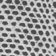][P70] | [diagr][B1], [t][t] [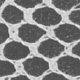][P94] | [diagr][C1], [t][t] [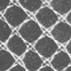][P114] | [diagr][D1], [t][t] [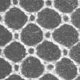][P134] | [diagr][E1], [t][t] [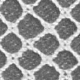][P155] | [diagr][F1], [t][t] [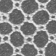][P177] | [diagr][G1], [t][t] [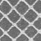][P198] | N1 [t][t] [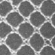][P219] |
|  2  | [diagr][A2], [v][v] [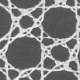][P71] | [diagr][B2], [v][v] [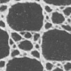][P95] | &nbsp; [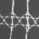][P115] |  [diagr][D2] [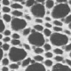][P135] | [diagr][E2] [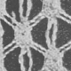][P156] | [diagr][F2], [ts][ts] [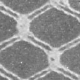][P178] | [diagr][G2] [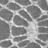][P199] | [diagr][H2] [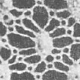][P220] |
|  3  | [diagr][A3], [t][t] [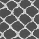][P73] | [diagr][B3], [t][t] [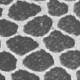][P96] | [diagr][C3], [t][t] [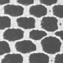][P117] | [diagr][D3], [t][t]  [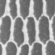][P136] | [diagr][E3], [t][t] [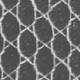][P157] | [diagr][F3], [t][t] [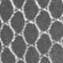][P179] | [diagr][G3], [t][t] [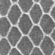][P200] | chaotic [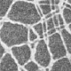][P221] |
|  4  | N3 [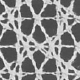][P74] | N3 [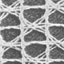][P97] | [diagr][C4], [k][k] [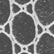][P118] | [diagr][D4], [k][k] [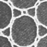][P137] | [diagr][E4] [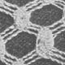][P158] | [diagr][F4],  [z][z] [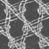][P180] | [diagr][G4] [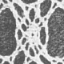][P201] | [diagr][H4], [v][v] [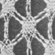][P222] |
|  5  | [diagr][A5], [k][k] [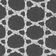][P75] | [diagr][B5], [k][k] [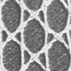][P98] | [diagr][C5], [k][k] [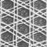][P119] | [diagr][D5], [c][c] [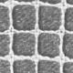][P138] | N3 [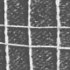][P159] | [diagr][F5], [c][c] [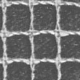][P181] | [diagr][G5], [c][c] [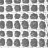][P203] | [diagr][H5], [c][c] [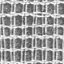][P224] |
|  6  | [diagr][A6], [k][k] [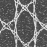][P76] | [diagr][B6], [v][v] [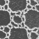][P99] | [diagr][C6], [v][v] [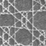][P120] | [diagr][D6], [z][z] [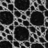][P139] | [diagr][E6] [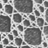][P160] | [diagr][F6], [t][t] [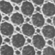][P182] | N3 [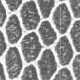][P204] | [diagr][H6] [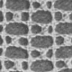][P225] |
|     | **A** | **B** | **C** | **D** | **E** | **F** | **G** | **H** |

[P70]: https://archive.org/details/laceguideformak00whit/page/70
[P71]: https://archive.org/details/laceguideformak00whit/page/71
[P73]: https://archive.org/details/laceguideformak00whit/page/73
[P74]: https://archive.org/details/laceguideformak00whit/page/74
[P75]: https://archive.org/details/laceguideformak00whit/page/75
[P76]: https://archive.org/details/laceguideformak00whit/page/76

[P94]: https://archive.org/details/laceguideformak00whit/page/94
[P95]: https://archive.org/details/laceguideformak00whit/page/95
[P96]: https://archive.org/details/laceguideformak00whit/page/96
[P97]: https://archive.org/details/laceguideformak00whit/page/97
[P98]: https://archive.org/details/laceguideformak00whit/page/98
[P99]: https://archive.org/details/laceguideformak00whit/page/99

[P114]: https://archive.org/details/laceguideformak00whit/page/114
[P115]: https://archive.org/details/laceguideformak00whit/page/115
[P116]: https://archive.org/details/laceguideformak00whit/page/116
[P117]: https://archive.org/details/laceguideformak00whit/page/117
[P118]: https://archive.org/details/laceguideformak00whit/page/118
[P119]: https://archive.org/details/laceguideformak00whit/page/119
[P120]: https://archive.org/details/laceguideformak00whit/page/120

[P134]: https://archive.org/details/laceguideformak00whit/page/134
[P135]: https://archive.org/details/laceguideformak00whit/page/135
[P136]: https://archive.org/details/laceguideformak00whit/page/136
[P137]: https://archive.org/details/laceguideformak00whit/page/137
[P138]: https://archive.org/details/laceguideformak00whit/page/138
[P139]: https://archive.org/details/laceguideformak00whit/page/139

[P155]: https://archive.org/details/laceguideformak00whit/page/155
[P156]: https://archive.org/details/laceguideformak00whit/page/156
[P157]: https://archive.org/details/laceguideformak00whit/page/157
[P158]: https://archive.org/details/laceguideformak00whit/page/158
[P159]: https://archive.org/details/laceguideformak00whit/page/159
[P160]: https://archive.org/details/laceguideformak00whit/page/160

[P177]: https://archive.org/details/laceguideformak00whit/page/177
[P178]: https://archive.org/details/laceguideformak00whit/page/178
[P179]: https://archive.org/details/laceguideformak00whit/page/179
[P180]: https://archive.org/details/laceguideformak00whit/page/180
[P181]: https://archive.org/details/laceguideformak00whit/page/181
[P182]: https://archive.org/details/laceguideformak00whit/page/182

[P198]: https://archive.org/details/laceguideformak00whit/page/198
[P199]: https://archive.org/details/laceguideformak00whit/page/199
[P200]: https://archive.org/details/laceguideformak00whit/page/200
[P201]: https://archive.org/details/laceguideformak00whit/page/201
[P203]: https://archive.org/details/laceguideformak00whit/page/203
[P204]: https://archive.org/details/laceguideformak00whit/page/204

[P219]: https://archive.org/details/laceguideformak00whit/page/219
[P220]: https://archive.org/details/laceguideformak00whit/page/220
[P221]: https://archive.org/details/laceguideformak00whit/page/221
[P222]: https://archive.org/details/laceguideformak00whit/page/222
[P224]: https://archive.org/details/laceguideformak00whit/page/224
[P225]: https://archive.org/details/laceguideformak00whit/page/225

<a name="notes"/>

Notes on the image captions
---------------------------
* **N1**

  The scanned image doesn't match the description by Whiting.

* **N2 &iquest;?**

  The patch is too small and shows only edge cases. It needs at least three repeats to be unambiguous.

* **N3 &mdash;**

  The ground uses sewings, three-pair stitches, odd number of threads, tallies and/or picots.
  None of these are supported by GroundForge.

* **N4 #**

  Bandages: dull for the objective of this page and too elaborate.
  
* **N5** short links

  lead to sets of pair diagrams. Each pattern in such a set can be morphed into the others by nudging pins.
  Only four of these links ([c],[t],[k],[v]) cover more than a third of the grounds in the table,
  a ratio that illustrates how many variations can be made by changing stitches or nudging pin positions.

[indexes]: http://www.gwydir.demon.co.uk/jo/lace/whiting/index.htm
[history]: https://github.com/d-bl/GroundForge/commits/master/docs/help/Whiting-Index.md
[changes]: https://github.com/d-bl/GroundForge/wiki/Whiting-Index/_history
[archive.org]: https://archive.org/details/laceguideformak00whit/page/234
[original sampler]: https://www.metmuseum.org/blogs/collection-insights/2018/gertrude-whiting-bobbin-lace-sampler
